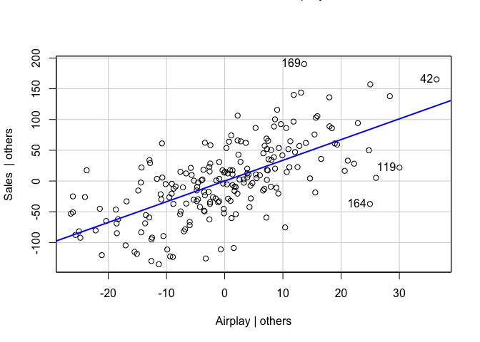

# Preface

There is a lot here and this R notebook is busy. I was trying to compare
the advice and examples available from different sources. There is a lot
to be said about regression diagnostics. Needless to say, don’t worry
about trying to understand all of this in one week. See if you can
connect a couple dots between what is said in the texts and what is in
this notebook and call it good.

That being said, this is a great resource for future learning and
analysis should you choose to take it on. Keep it as an aid for
understanding regression in the future.

# Regression Diagnostics

The regression diagnostics available in Jamovi are still limited. It
would be a good idea to augment what is available in Jamovi with some
regression diagnostics in R. This R markdown document provides an
example of performing a multiple regression using the lm() function in R
and following up with some regression diagnostics to evaluate bias and
generalizability of the model.

#### Additional resources

-   Field has a good example of fitting a regression model and getting
    regression diagnostics in his book Discovering Statistics Using R.
    <https://archive.org/details/discoveringstatisticsusingr/page/n307/mode/2up>
-   Applied Statistics with R Ch. 13 (optional) available at:
    <https://daviddalpiaz.github.io/appliedstats/model-diagnostics.html>
-   R for Researchers OLS (optional) available at:
    <https://ssc.wisc.edu/sscc/pubs/RFR/RFR_Regression.html>
-   R for Researchers regression diagnostics (optional) available at:
    <https://ssc.wisc.edu/sscc/pubs/RFR/RFR_Diagnostics.html>
-   Diagnostics in multiple linear regression (optional) available at:
    <https://web.stanford.edu/class/stats191/notebooks/Diagnostics_for_multiple_regression.html>
-   Introduction to regression diagnostics (optional) available at:
    <https://stats.idre.ucla.edu/wp-content/uploads/2019/02/R_reg_part2.html#(1)>
-   Regression model diagnostics (optional) available at:
    <http://www.sthda.com/english/articles/39-regression-model-diagnostics/161-linear-regression-assumptions-and-diagnostics-in-r-essentials/>
-   Regression diagnostics (optional) available at:
    <https://www.statmethods.net/stats/rdiagnostics.html>
-   Outlier detection with Mahalanobis distance (optional) available at:
    <https://www.r-bloggers.com/outlier-detection-with-mahalanobis-distance/>
-   Multivariate outlier (optional) available at:
    <https://en.wikiversity.org/wiki/Multivariate_outlier>

## Package management in R

``` r
# keep a list of the packages used in this script
packages <- c("tidyverse","rio","jmv","boot","car","lmtest","faraway","broom")
```

This next code block has eval=FALSE because you don’t want to run it
when knitting the file. Installing packages when knitting an R notebook
can be problematic.

``` r
# check each of the packages in the list and install them if they're not installed already
for (i in packages){
  if(! i %in% installed.packages()){
    install.packages(i,dependencies = TRUE)
  }
  # show each package that is checked
  print(i)
}
```

``` r
# load each package into memory so it can be used in the script
for (i in packages){
  library(i,character.only=TRUE)
  # show each package that is loaded
  print(i)
}
```

    ## ── Attaching packages ─────────────────────────────────────── tidyverse 1.3.1 ──

    ## ✓ ggplot2 3.3.5     ✓ purrr   0.3.4
    ## ✓ tibble  3.1.6     ✓ dplyr   1.0.7
    ## ✓ tidyr   1.1.4     ✓ stringr 1.4.0
    ## ✓ readr   2.1.1     ✓ forcats 0.5.1

    ## ── Conflicts ────────────────────────────────────────── tidyverse_conflicts() ──
    ## x dplyr::filter() masks stats::filter()
    ## x dplyr::lag()    masks stats::lag()

    ## [1] "tidyverse"
    ## [1] "rio"
    ## [1] "jmv"
    ## [1] "boot"

    ## Loading required package: carData

    ## 
    ## Attaching package: 'car'

    ## The following object is masked from 'package:boot':
    ## 
    ##     logit

    ## The following object is masked from 'package:dplyr':
    ## 
    ##     recode

    ## The following object is masked from 'package:purrr':
    ## 
    ##     some

    ## [1] "car"

    ## Loading required package: zoo

    ## 
    ## Attaching package: 'zoo'

    ## The following objects are masked from 'package:base':
    ## 
    ##     as.Date, as.Date.numeric

    ## [1] "lmtest"

    ## 
    ## Attaching package: 'faraway'

    ## The following objects are masked from 'package:car':
    ## 
    ##     logit, vif

    ## The following objects are masked from 'package:boot':
    ## 
    ##     logit, melanoma

    ## [1] "faraway"
    ## [1] "broom"

## Regression Diagnostics

Regression diagnostics should be performed when fitting a linear model
to assess for bias and generalizability of the model.

## Open data file

The rio package works for importing several different types of data
files. We’re going to use it in this class. There are other packages
which can be used to open datasets in R. You can see several options by
clicking on the Import Dataset menu under the Environment tab in
RStudio. (For a csv file like we have this week we’d use either From
Text(base) or From Text (readr). Try it out to see the menu dialog.)

``` r
# Using the file.choose() command allows you to select a file to import from another folder.
# dataset <- rio::import(file.choose())
dataset <- rio::import("Album Sales.sav")
```

## lm() function in R

Many linear models are calculated in R using the lm() function. We’ll
look at how to perform a multiple regression using the lm() function
since it’s so common.

#### Visualization

``` r
# This code creates a scatter matrix
library(GGally)
```

    ## Registered S3 method overwritten by 'GGally':
    ##   method from   
    ##   +.gg   ggplot2

    ## 
    ## Attaching package: 'GGally'

    ## The following object is masked from 'package:faraway':
    ## 
    ##     happy

``` r
GGally::ggpairs(dataset, columns=c('Sales','Adverts','Airplay','Image'), lower = list(continuous = "smooth"))
```


``` r
# This code creates a scatterplot between a single pair of variables
ggplot(dataset, aes(x = Adverts, y = Sales)) +
  geom_point() +
  stat_smooth(method = lm)
```

    ## `geom_smooth()` using formula 'y ~ x'


#### Computation

Multiple models adding variables in steps can be created in R using the
lm() and update() functions.

``` r
model.1 <- lm(formula = Sales ~ Adverts, data = dataset)
model.2 <- update(model.1, .~. + Airplay)
model.3 <- update(model.2, .~. + Image)
```

#### Model assessment

``` r
summary(model.1)
```

    ## 
    ## Call:
    ## lm(formula = Sales ~ Adverts, data = dataset)
    ## 
    ## Residuals:
    ##      Min       1Q   Median       3Q      Max 
    ## -152.949  -43.796   -0.393   37.040  211.866 
    ## 
    ## Coefficients:
    ##              Estimate Std. Error t value Pr(>|t|)    
    ## (Intercept) 1.341e+02  7.537e+00  17.799   <2e-16 ***
    ## Adverts     9.612e-02  9.632e-03   9.979   <2e-16 ***
    ## ---
    ## Signif. codes:  0 '***' 0.001 '**' 0.01 '*' 0.05 '.' 0.1 ' ' 1
    ## 
    ## Residual standard error: 65.99 on 198 degrees of freedom
    ## Multiple R-squared:  0.3346, Adjusted R-squared:  0.3313 
    ## F-statistic: 99.59 on 1 and 198 DF,  p-value: < 2.2e-16

``` r
summary(model.2)
```

    ## 
    ## Call:
    ## lm(formula = Sales ~ Adverts + Airplay, data = dataset)
    ## 
    ## Residuals:
    ##      Min       1Q   Median       3Q      Max 
    ## -112.121  -30.027    3.952   32.072  155.498 
    ## 
    ## Coefficients:
    ##              Estimate Std. Error t value Pr(>|t|)    
    ## (Intercept) 41.123811   9.330952   4.407 1.72e-05 ***
    ## Adverts      0.086887   0.007246  11.991  < 2e-16 ***
    ## Airplay      3.588789   0.286807  12.513  < 2e-16 ***
    ## ---
    ## Signif. codes:  0 '***' 0.001 '**' 0.01 '*' 0.05 '.' 0.1 ' ' 1
    ## 
    ## Residual standard error: 49.38 on 197 degrees of freedom
    ## Multiple R-squared:  0.6293, Adjusted R-squared:  0.6255 
    ## F-statistic: 167.2 on 2 and 197 DF,  p-value: < 2.2e-16

``` r
summary(model.3)
```

    ## 
    ## Call:
    ## lm(formula = Sales ~ Adverts + Airplay + Image, data = dataset)
    ## 
    ## Residuals:
    ##      Min       1Q   Median       3Q      Max 
    ## -121.324  -28.336   -0.451   28.967  144.132 
    ## 
    ## Coefficients:
    ##               Estimate Std. Error t value Pr(>|t|)    
    ## (Intercept) -26.612958  17.350001  -1.534    0.127    
    ## Adverts       0.084885   0.006923  12.261  < 2e-16 ***
    ## Airplay       3.367425   0.277771  12.123  < 2e-16 ***
    ## Image        11.086335   2.437849   4.548 9.49e-06 ***
    ## ---
    ## Signif. codes:  0 '***' 0.001 '**' 0.01 '*' 0.05 '.' 0.1 ' ' 1
    ## 
    ## Residual standard error: 47.09 on 196 degrees of freedom
    ## Multiple R-squared:  0.6647, Adjusted R-squared:  0.6595 
    ## F-statistic: 129.5 on 3 and 196 DF,  p-value: < 2.2e-16

#### Standardized residuals from lm()

You might notice lm() does not provide the standardized residuals. Those
must me calculated separately.

``` r
standardized = lm(scale(Sales) ~ scale(Adverts) + scale(Airplay) + scale(Image), data=dataset)
summary(standardized)
```

    ## 
    ## Call:
    ## lm(formula = scale(Sales) ~ scale(Adverts) + scale(Airplay) + 
    ##     scale(Image), data = dataset)
    ## 
    ## Residuals:
    ##      Min       1Q   Median       3Q      Max 
    ## -1.50342 -0.35113 -0.00559  0.35895  1.78605 
    ## 
    ## Coefficients:
    ##                  Estimate Std. Error t value Pr(>|t|)    
    ## (Intercept)    -5.586e-17  4.126e-02   0.000        1    
    ## scale(Adverts)  5.108e-01  4.166e-02  12.261  < 2e-16 ***
    ## scale(Airplay)  5.120e-01  4.223e-02  12.123  < 2e-16 ***
    ## scale(Image)    1.917e-01  4.215e-02   4.548 9.49e-06 ***
    ## ---
    ## Signif. codes:  0 '***' 0.001 '**' 0.01 '*' 0.05 '.' 0.1 ' ' 1
    ## 
    ## Residual standard error: 0.5835 on 196 degrees of freedom
    ## Multiple R-squared:  0.6647, Adjusted R-squared:  0.6595 
    ## F-statistic: 129.5 on 3 and 196 DF,  p-value: < 2.2e-16

Another option for getting standardized residuals is in the QuantPsyc
package.

#### Confidence intervals for the parameters

The lm() function didn’t provide confidence intervals for the model
parameters. This can be done using the confint() function.

``` r
confint(model.3)
```

    ##                    2.5 %      97.5 %
    ## (Intercept) -60.82960967  7.60369295
    ## Adverts       0.07123166  0.09853799
    ## Airplay       2.81962186  3.91522848
    ## Image         6.27855218 15.89411823

#### AIC & BIC

From <https://ssc.wisc.edu/sscc/pubs/RFR/RFR_Regression.html>

``` r
# Smaller values indicate a better model
AIC(model.1)
```

    ## [1] 2247.375

``` r
AIC(model.2)
```

    ## [1] 2132.398

``` r
AIC(model.3)
```

    ## [1] 2114.337

``` r
BIC(model.1)
```

    ## [1] 2257.27

``` r
BIC(model.2)
```

    ## [1] 2145.592

``` r
BIC(model.3)
```

    ## [1] 2130.828

#### Compare models

Hierarchal models can be compared using ANOVA.

``` r
anova(model.1, model.2, model.3)
```

    ## Analysis of Variance Table
    ## 
    ## Model 1: Sales ~ Adverts
    ## Model 2: Sales ~ Adverts + Airplay
    ## Model 3: Sales ~ Adverts + Airplay + Image
    ##   Res.Df    RSS Df Sum of Sq       F    Pr(>F)    
    ## 1    198 862264                                   
    ## 2    197 480428  1    381836 172.214 < 2.2e-16 ***
    ## 3    196 434575  1     45853  20.681 9.492e-06 ***
    ## ---
    ## Signif. codes:  0 '***' 0.001 '**' 0.01 '*' 0.05 '.' 0.1 ' ' 1

## Evaluating for bias in the model

#### Add observation statistics to data (missing in Jamovi)

``` r
# add ID column
dataset$id = 1:nrow(dataset)

# Outliers
dataset$m3resid = round(resid(model.3), digits = 3)
dataset$m3stdres = round(rstandard(model.3), digits = 3)
dataset$m3studres = round(rstudent(model.3), digits = 3)

# Influential cases
dataset$m3cooks = round(cooks.distance(model.3), digits = 3)
dataset$m3dfbetas = round(dfbetas(model.3), digits = 3)
dataset$m3dffits = round(dffits(model.3), digits = 3)
dataset$m3lev = round(hatvalues(model.3), digits = 3)
dataset$m3covrat = round(covratio(model.3), digits = 3)
dataset$m3mahal = mahalanobis(dataset[,c("Adverts","Airplay","Image")],colMeans(dataset[,c("Adverts","Airplay","Image")]),cov(dataset[,c("Adverts","Airplay","Image")]))

# fitted values
dataset$fitted <- round(model.3$fitted.values, digits = 3)
```

After I created a lot of this code, I ran across a function to get a lot
of regression diagnostics quickly. The site seems to give some examples
using more tidyverse notation. From
<http://www.sthda.com/english/articles/39-regression-model-diagnostics/161-linear-regression-assumptions-and-diagnostics-in-r-essentials/>

``` r
model.diag.metrics <- broom::augment(model.3)
head(model.diag.metrics)
```

    ## # A tibble: 6 × 10
    ##   Sales Adverts Airplay Image .fitted  .resid    .hat .sigma  .cooksd .std.resid
    ##   <dbl>   <dbl>   <dbl> <dbl>   <dbl>   <dbl>   <dbl>  <dbl>    <dbl>      <dbl>
    ## 1   330    10.3      43    10    230.  100.   0.0472    46.6  5.87e-2      2.18 
    ## 2   120   986.       28     7    229. -109.   0.00801   46.6  1.09e-2     -2.32 
    ## 3   360  1446.       35     7    292.   68.4  0.0207    46.9  1.14e-2      1.47 
    ## 4   270  1188.       33     7    263.    7.02 0.0126    47.2  7.17e-5      0.150
    ## 5   220   575.       44     5    226.   -5.75 0.0261    47.2  1.03e-4     -0.124
    ## 6   170   569.       19     5    141.   28.9  0.0142    47.2  1.38e-3      0.618

#### Flag cases for investigation

``` r
# studentized residuals greater than 2 (or 3)
# No more than 5% of cases above 2. No more than 1% above 2.5.
print("Studentized residuals greater than 2 or 3")
```

    ## [1] "Studentized residuals greater than 2 or 3"

``` r
dataset$largeRes <- dataset$m3studres > 3 | dataset$m3studres < -3
dataset[dataset$largeRes, c("id")]
```

    ## [1] 169

``` r
# Cook's greater than 1
# Any case
print("Cook's value greater than 1")
```

    ## [1] "Cook's value greater than 1"

``` r
dataset$largeCook <- dataset$m3cooks > 1 | dataset$m3cooks < -1
dataset[dataset$largeCook, c("id")]
```

    ## integer(0)

``` r
# Mahalanobis distance greater than chi-square critical value df=number predictors
# related to leverage
print("Mahalanobis distance greater than chi-square cutoff")
```

    ## [1] "Mahalanobis distance greater than chi-square cutoff"

``` r
dataset$largeMahal <- dataset$m3mahal > qchisq(.99, df=3)
dataset[dataset$largeMahal, c("id")]
```

    ## [1]   7  12 138 181 184

``` r
# leverage greater than 2 (or 3) times average 
print("Leverage greater than 2 or 3 times the average")
```

    ## [1] "Leverage greater than 2 or 3 times the average"

``` r
averageLeverage = (3 + 1)/200
dataset$largeLev <- dataset$m3lev > 3*averageLeverage
dataset[dataset$largeLev, c("id")]
```

    ## [1]   7  12 138 181 184

``` r
# covariance ratio out of bounds (1 +/- (k*(K+1)/n))
print("Covariance ratio out of bounds")
```

    ## [1] "Covariance ratio out of bounds"

``` r
dataset$COVcheck <- dataset$m3covrat > (1 + (3*(3+1)/200)) | dataset$m3covrat < (1 - (3*(3+1)/200))
dataset[dataset$COVcheck, c("id")]
```

    ##  [1]   2   7  12  23  42  43  47  55  61  68  87  88  93 116 138 164 169 181 184
    ## [20] 199

``` r
# standardized dfbeta greater than 1 - b change when exclude cases
print("Standardized dfbeta greater than 1")
```

    ## [1] "Standardized dfbeta greater than 1"

``` r
dataset$largedfbeta <- dataset$m3dfbetas > 1 | dataset$m3dfbetas < -1
dataset[dataset$largedfbeta, c("id")]
```

    ## integer(0)

``` r
# standardized dffit greater than 1 - predicted values change when exclude cases
print("Standardized dffit greater than 1")
```

    ## [1] "Standardized dffit greater than 1"

``` r
dataset$largedffit <- dataset$m3dffits > 1 | dataset$m3dffits < -1
dataset[dataset$largedffit, c("id")]
```

    ## integer(0)

There is another function in R to help flag potentially influential
cases

``` r
# https://web.stanford.edu/class/stats191/notebooks/Diagnostics_for_multiple_regression.html
influence.measures(model.3)
```

    ## Influence measures of
    ##   lm(formula = Sales ~ Adverts + Airplay + Image, data = dataset) :
    ## 
    ##        dfb.1_  dfb.Advr  dfb.Arpl  dfb.Imag    dffit cov.r   cook.d     hat inf
    ## 1   -3.16e-01 -2.42e-01  0.157739  0.353292  0.48929 0.971 5.87e-02 0.04719   *
    ## 2    1.26e-02 -1.26e-01  0.009421 -0.018683 -0.21110 0.920 1.09e-02 0.00801   *
    ## 3   -3.81e-02  1.75e-01  0.046574 -0.005385  0.21418 0.997 1.14e-02 0.02070    
    ## 4   -2.58e-03  1.22e-02  0.003444  0.000129  0.01689 1.033 7.17e-05 0.01256    
    ## 5   -8.58e-03  1.09e-03 -0.014254  0.013554 -0.02020 1.048 1.03e-04 0.02607    
    ## 6    6.58e-02  2.24e-03 -0.020820 -0.051246  0.07411 1.027 1.38e-03 0.01421    
    ## 7   -1.45e-01 -1.00e-03 -0.005086  0.147724 -0.15389 1.117 5.94e-03 0.09104   *
    ## 8   -2.81e-02 -5.86e-03 -0.019167  0.045204  0.05366 1.040 7.23e-04 0.02092    
    ## 9    1.12e-02 -8.96e-03 -0.028957  0.014483  0.06154 1.016 9.49e-04 0.00691    
    ## 10  -1.26e-02 -1.56e-01  0.167721  0.006723  0.26896 0.944 1.78e-02 0.01541    
    ## 11   8.75e-03 -5.17e-02 -0.003237  0.001001 -0.05723 1.051 8.23e-04 0.03118    
    ## 12  -2.41e-01 -1.95e-02  0.000943  0.243196 -0.25743 1.069 1.66e-02 0.06410   *
    ## 13   8.59e-03  1.70e-02  0.008258 -0.021579 -0.03484 1.032 3.05e-04 0.01303    
    ## 14   1.29e-02 -2.35e-02  0.022549 -0.013673  0.03943 1.037 3.90e-04 0.01751    
    ## 15   2.05e-02 -4.65e-02 -0.031639  0.027607  0.12762 0.977 4.04e-03 0.00652    
    ## 16  -7.91e-02  3.38e-02 -0.004497  0.065656 -0.09386 1.024 2.21e-03 0.01504    
    ## 17  -1.29e-02 -2.08e-02 -0.010016  0.020810 -0.03286 1.049 2.71e-04 0.02803    
    ## 18  -9.64e-03 -1.50e-02  0.009564  0.012653  0.02659 1.036 1.78e-04 0.01527    
    ## 19  -1.73e-02  3.14e-02 -0.007284  0.017893  0.04320 1.039 4.69e-04 0.01930    
    ## 20   8.61e-02 -1.39e-01 -0.014776 -0.066685 -0.18790 1.007 8.80e-03 0.02051    
    ## 21   3.57e-03 -9.31e-03 -0.011585 -0.001884 -0.03346 1.024 2.81e-04 0.00655    
    ## 22   1.24e-02  1.64e-02  0.001698 -0.013572  0.03020 1.028 2.29e-04 0.00941    
    ## 23   1.55e-02 -2.22e-02  0.002822 -0.013787 -0.02865 1.068 2.06e-04 0.04482   *
    ## 24   1.72e-03 -4.69e-04 -0.008513 -0.001144 -0.01913 1.026 9.19e-05 0.00644    
    ## 25   2.36e-02  1.00e-02 -0.102957  0.008510 -0.11874 1.028 3.53e-03 0.02070    
    ## 26  -3.05e-02 -3.15e-02  0.038147  0.030725  0.07196 1.030 1.30e-03 0.01575    
    ## 27  -1.80e-01  3.25e-02  0.018116  0.155755 -0.18840 1.020 8.86e-03 0.02590    
    ## 28  -5.35e-03  1.80e-02  0.010007 -0.001654  0.02371 1.050 1.41e-04 0.02853    
    ## 29   3.14e-02  6.82e-02 -0.031088 -0.047175 -0.10295 1.027 2.66e-03 0.01774    
    ## 30   2.60e-02  1.35e-02 -0.039236 -0.007581  0.04967 1.038 6.20e-04 0.01949    
    ## 31   1.85e-02  8.55e-02 -0.133634  0.005857 -0.16928 1.028 7.16e-03 0.02759    
    ## 32   3.96e-02  5.81e-02  0.098406 -0.126250 -0.19909 0.977 9.82e-03 0.01387    
    ## 33  -1.49e-02  2.72e-02 -0.041884  0.021926 -0.05923 1.037 8.81e-04 0.01909    
    ## 34  -3.97e-03 -3.94e-03  0.016153 -0.004047 -0.01859 1.044 8.68e-05 0.02266    
    ## 35   3.04e-02  1.02e-01  0.064906 -0.069895  0.16442 1.003 6.74e-03 0.01601    
    ## 36  -8.74e-03  3.24e-02  0.022819  0.005440  0.08670 1.004 1.88e-03 0.00666    
    ## 37   6.83e-02 -8.27e-02  0.019384 -0.042493  0.12718 1.004 4.04e-03 0.01149    
    ## 38   2.29e-02  4.55e-02  0.016380 -0.054531 -0.08905 1.021 1.99e-03 0.01299    
    ## 39   4.83e-02 -6.37e-04 -0.024631 -0.052542 -0.09128 1.013 2.08e-03 0.00961    
    ## 40  -1.55e-02 -1.51e-03  0.008420  0.008903 -0.02331 1.027 1.36e-04 0.00752    
    ## 41   3.78e-03 -1.21e-02 -0.009467 -0.000679 -0.02647 1.027 1.76e-04 0.00812    
    ## 42  -3.58e-02 -9.83e-02  0.206271 -0.018746  0.23182 1.065 1.34e-02 0.05823   *
    ## 43  -1.04e-02  6.63e-02  0.000144 -0.001539  0.07067 1.068 1.25e-03 0.04593   *
    ## 44  -7.70e-04  2.14e-02 -0.007418  0.003410  0.03230 1.028 2.62e-04 0.00967    
    ## 45   1.29e-02  4.09e-02 -0.083959  0.000910 -0.11410 1.015 3.26e-03 0.01380    
    ## 46   5.46e-02 -2.30e-01 -0.077306  0.011464 -0.28216 0.978 1.97e-02 0.02380    
    ## 47   6.64e-02  1.96e-01  0.048288 -0.178574 -0.31469 0.915 2.41e-02 0.01568   *
    ## 48   1.05e-02 -4.39e-02 -0.004067  0.012615  0.06877 1.019 1.19e-03 0.00888    
    ## 49  -4.57e-03  1.34e-02  0.010421 -0.000924  0.02186 1.036 1.20e-04 0.01504    
    ## 50  -4.22e-02  9.52e-04  0.173808 -0.012978  0.21041 0.983 1.10e-02 0.01649    
    ## 51   1.51e-02  1.10e-02  0.026222 -0.023993  0.04854 1.027 5.91e-04 0.01033    
    ## 52   3.53e-01 -2.88e-02 -0.136669 -0.269650  0.36742 0.960 3.32e-02 0.02921    
    ## 53   4.81e-03 -4.32e-02 -0.123515  0.074557  0.15430 1.048 5.96e-03 0.03793    
    ## 54  -1.73e-02 -2.36e-03 -0.000888  0.024897  0.03786 1.027 3.60e-04 0.00895    
    ## 55   1.74e-01 -3.26e-01 -0.023068 -0.124349 -0.40736 0.925 4.04e-02 0.02610   *
    ## 56   5.12e-03 -4.60e-02  0.003598 -0.004287 -0.06477 1.023 1.05e-03 0.01035    
    ## 57   3.51e-02  2.42e-02 -0.050804 -0.012286  0.06839 1.034 1.17e-03 0.01791    
    ## 58  -2.19e-02  3.40e-02  0.073443 -0.001318  0.12487 0.996 3.89e-03 0.00938    
    ## 59  -4.05e-02  1.08e-02  0.005168  0.033754 -0.04241 1.048 4.52e-04 0.02713    
    ## 60  -4.52e-02 -5.95e-02  0.064342  0.022212 -0.10409 1.028 2.71e-03 0.01874    
    ## 61   8.19e-04 -1.54e-02  0.027926  0.020543  0.15562 0.937 5.95e-03 0.00535   *
    ## 62  -3.73e-02  5.94e-02  0.019305  0.021939  0.07937 1.043 1.58e-03 0.02597    
    ## 63   2.15e-02 -9.71e-03  0.027330 -0.041342 -0.06376 1.024 1.02e-03 0.01109    
    ## 64  -2.82e-02  3.43e-02  0.004978  0.012469 -0.04889 1.031 6.00e-04 0.01357    
    ## 65  -3.07e-02 -1.57e-02 -0.021028  0.052067  0.06276 1.040 9.89e-04 0.02206    
    ## 66  -2.83e-02  6.60e-02  0.051708 -0.029031 -0.12539 0.999 3.92e-03 0.01006    
    ## 67  -3.54e-02  2.17e-02  0.022872  0.013776 -0.05296 1.026 7.04e-04 0.01068    
    ## 68  -2.81e-03  2.11e-01 -0.147655 -0.017599 -0.30216 0.924 2.23e-02 0.01571   *
    ## 69   3.11e-02  9.69e-02  0.141662 -0.150488 -0.25404 0.966 1.59e-02 0.01775    
    ## 70  -2.21e-02 -6.36e-03  0.007563  0.028092  0.04557 1.026 5.21e-04 0.00931    
    ## 71   7.95e-02 -5.18e-02  0.010488 -0.064341  0.10080 1.027 2.55e-03 0.01786    
    ## 72  -4.36e-02 -2.80e-02  0.050914  0.034896  0.07541 1.060 1.43e-03 0.03995    
    ## 73  -3.40e-03  1.93e-02 -0.001904 -0.003926 -0.02579 1.032 1.67e-04 0.01174    
    ## 74   2.78e-04 -7.43e-05 -0.001700 -0.000493 -0.00534 1.026 7.16e-06 0.00573    
    ## 75  -9.23e-03  1.17e-01 -0.030460  0.006431  0.13429 1.028 4.51e-03 0.02289    
    ## 76   5.48e-02 -9.54e-02  0.085614 -0.055135  0.15795 1.007 6.22e-03 0.01654    
    ## 77  -5.40e-02  1.76e-02  0.001946  0.067477  0.10805 1.004 2.91e-03 0.00916    
    ## 78   2.45e-02 -6.93e-02 -0.039287  0.022734  0.10402 1.019 2.71e-03 0.01411    
    ## 79  -2.09e-02  3.82e-03 -0.139606  0.069215 -0.16783 1.016 7.03e-03 0.02138    
    ## 80   1.42e-02 -9.94e-03 -0.001071 -0.010067  0.01755 1.041 7.74e-05 0.01963    
    ## 81   9.96e-04  6.87e-03  0.015221 -0.011845 -0.02172 1.046 1.19e-04 0.02443    
    ## 82   1.10e-01 -1.77e-02 -0.075900 -0.067595  0.12366 1.058 3.84e-03 0.04249    
    ## 83   1.20e-01 -8.51e-02 -0.170752 -0.008363  0.22090 1.026 1.22e-02 0.03356    
    ## 84   1.38e-02 -2.80e-02  0.026471 -0.014942  0.04518 1.039 5.13e-04 0.01972    
    ## 85  -1.22e-01 -3.32e-02  0.103319  0.074608 -0.15847 1.024 6.28e-03 0.02372    
    ## 86  -4.29e-02  1.28e-01  0.098342 -0.006909  0.21451 0.966 1.14e-02 0.01344    
    ## 87   5.23e-02  2.06e-01  0.042815 -0.113375  0.24366 1.063 1.48e-02 0.05815   *
    ## 88  -2.07e-02 -7.81e-02 -0.032203  0.050616 -0.10072 1.074 2.55e-03 0.05328   *
    ## 89  -7.74e-03  2.43e-02  0.010067 -0.007857 -0.03730 1.029 3.49e-04 0.01098    
    ## 90   1.61e-02  2.94e-02  0.004568 -0.033691 -0.05588 1.029 7.84e-04 0.01262    
    ## 91  -5.37e-03 -8.31e-03 -0.003527  0.007220 -0.01557 1.031 6.09e-05 0.01021    
    ## 92  -1.78e-03  1.15e-01 -0.057331  0.011664  0.14045 1.029 4.94e-03 0.02397    
    ## 93  -2.28e-02  3.14e-02 -0.012093  0.024707  0.04441 1.061 4.95e-04 0.03899    
    ## 94   6.92e-02 -5.21e-02 -0.212508  0.058739  0.24501 1.015 1.49e-02 0.03148    
    ## 95  -3.17e-02  1.64e-02  0.023713  0.025282  0.05632 1.028 7.96e-04 0.01248    
    ## 96  -2.78e-02 -3.79e-02  0.004403  0.027559 -0.06543 1.022 1.07e-03 0.00982    
    ## 97   8.06e-02 -4.92e-02 -0.084344 -0.018812  0.12958 1.018 4.20e-03 0.01703    
    ## 98  -5.83e-03 -3.05e-03 -0.007200  0.007894 -0.01561 1.029 6.12e-05 0.00894    
    ## 99   8.85e-02 -1.11e-01 -0.279325  0.038921 -0.33721 0.990 2.81e-02 0.03428    
    ## 100  6.11e-02  1.45e-01 -0.299835  0.067664  0.35732 0.959 3.14e-02 0.02778    
    ## 101 -4.37e-02  7.04e-02 -0.046088  0.036563 -0.10779 1.020 2.91e-03 0.01500    
    ## 102  5.65e-02 -4.70e-02 -0.012821 -0.048374 -0.08237 1.045 1.70e-03 0.02827    
    ## 103  1.48e-02  7.81e-02  0.125243 -0.113185 -0.20118 1.005 1.01e-02 0.02151    
    ## 104 -1.08e-02  5.69e-03  0.002933  0.005915 -0.01598 1.028 6.42e-05 0.00790    
    ## 105  1.40e-02 -5.30e-02  0.156092 -0.060038  0.17773 1.041 7.90e-03 0.03631    
    ## 106  1.39e-02 -2.65e-02 -0.029883  0.013962  0.05786 1.025 8.40e-04 0.01075    
    ## 107 -1.26e-03  6.34e-05  0.004387 -0.001138 -0.00488 1.050 5.97e-06 0.02824    
    ## 108  1.25e-01 -8.62e-02 -0.128198 -0.028115  0.20283 0.992 1.02e-02 0.01779    
    ## 109  1.13e-02  3.15e-02 -0.003884 -0.023162 -0.04553 1.036 5.20e-04 0.01709    
    ## 110  2.99e-03 -9.75e-03 -0.003711  0.002983  0.01440 1.032 5.21e-05 0.01167    
    ## 111  4.76e-02 -6.60e-02  0.067924 -0.048939  0.12645 1.010 3.99e-03 0.01347    
    ## 112 -7.80e-03 -5.58e-03  0.007208  0.008468  0.01682 1.033 7.11e-05 0.01220    
    ## 113 -2.35e-01 -7.19e-03  0.082070  0.195385 -0.24220 1.045 1.47e-02 0.04709    
    ## 114  2.66e-03 -2.34e-03 -0.007962  0.002258  0.00937 1.052 2.20e-05 0.03012    
    ## 115  2.23e-04 -5.43e-04  0.000890 -0.000624 -0.00127 1.046 4.05e-07 0.02379    
    ## 116  7.97e-03  1.37e-02  0.028313 -0.027777 -0.04165 1.069 4.36e-04 0.04631   *
    ## 117 -1.24e-02  3.25e-03  0.039396 -0.013050 -0.05316 1.028 7.09e-04 0.01182    
    ## 118  1.82e-03  1.98e-04 -0.000498 -0.001478  0.00208 1.035 1.09e-06 0.01397    
    ## 119  4.22e-03 -5.44e-02 -0.312272  0.128968 -0.35302 1.001 3.08e-02 0.04009    
    ## 120 -2.41e-03 -7.02e-03 -0.006771  0.009197  0.01530 1.037 5.88e-05 0.01607    
    ## 121  9.33e-04  1.73e-03 -0.005990 -0.000649 -0.01174 1.028 3.46e-05 0.00705    
    ## 122  8.18e-02 -9.35e-03 -0.011522 -0.066988  0.09185 1.022 2.11e-03 0.01347    
    ## 123  9.50e-03 -1.69e-02 -0.021561  0.009092  0.03728 1.031 3.49e-04 0.01260    
    ## 124 -5.74e-02 -7.51e-03  0.235677 -0.024053  0.26237 0.997 1.71e-02 0.02696    
    ## 125 -1.02e-01  7.02e-02  0.134428  0.011323 -0.18024 1.026 8.12e-03 0.02788    
    ## 126 -1.68e-02 -9.47e-02 -0.002248  0.033586 -0.10949 1.040 3.01e-03 0.02692    
    ## 127 -1.36e-02 -6.77e-02  0.105225 -0.000936  0.14475 1.012 5.23e-03 0.01670    
    ## 128 -7.77e-03  7.88e-02 -0.014248  0.003901  0.09226 1.032 2.13e-03 0.01942    
    ## 129  1.30e-04  4.13e-03 -0.000137  0.003108  0.02172 1.024 1.19e-04 0.00533    
    ## 130  2.85e-02 -7.23e-03 -0.020753 -0.025406 -0.05111 1.027 6.56e-04 0.01109    
    ## 131  7.60e-02 -1.04e-02  0.038077 -0.082520  0.10634 1.021 2.83e-03 0.01509    
    ## 132  2.16e-03 -7.39e-03 -0.004958 -0.000300 -0.01457 1.029 5.33e-05 0.00867    
    ## 133  3.66e-04 -8.24e-03  0.016324  0.012010  0.09129 0.994 2.08e-03 0.00534    
    ## 134 -3.25e-03 -1.09e-02  0.016951 -0.004657 -0.02464 1.034 1.53e-04 0.01348    
    ## 135 -9.34e-03  2.25e-02  0.014838 -0.011282 -0.05087 1.021 6.49e-04 0.00741    
    ## 136 -1.28e-02  1.47e-02  0.000722  0.012566  0.02598 1.033 1.70e-04 0.01319    
    ## 137  7.80e-02 -4.58e-02 -0.010743 -0.055318  0.09254 1.029 2.15e-03 0.01796    
    ## 138 -1.41e-01  3.37e-02 -0.031591  0.147462 -0.15770 1.127 6.24e-03 0.09871   *
    ## 139  1.08e-03  1.05e-02 -0.009229  0.002497  0.01687 1.035 7.15e-05 0.01379    
    ## 140  9.24e-05 -1.78e-03  0.000106 -0.000654 -0.00517 1.027 6.72e-06 0.00583    
    ## 141  5.27e-02 -4.72e-02 -0.031523 -0.040181 -0.09674 1.022 2.34e-03 0.01425    
    ## 142  6.32e-03  6.36e-03 -0.000790 -0.005866  0.01322 1.029 4.39e-05 0.00850    
    ## 143 -1.04e-02 -1.49e-02  0.002184  0.017705  0.03001 1.031 2.26e-04 0.01184    
    ## 144 -1.11e-02 -2.57e-02  0.053137 -0.013211 -0.06695 1.035 1.13e-03 0.01896    
    ## 145 -2.34e-02  5.89e-02  0.039273 -0.024562 -0.10848 1.005 2.94e-03 0.00959    
    ## 146  7.79e-02  2.92e-02  0.084972 -0.145121 -0.17879 1.019 7.98e-03 0.02438    
    ## 147 -1.08e-02  1.81e-02  0.025799 -0.010021 -0.04087 1.033 4.19e-04 0.01465    
    ## 148 -4.14e-02  1.45e-01  0.078695 -0.008187  0.20400 0.990 1.03e-02 0.01745    
    ## 149 -3.38e-02 -3.23e-02 -0.059904  0.055814 -0.11380 1.007 3.23e-03 0.01066    
    ## 150  2.74e-03  1.27e-02 -0.030423 -0.009358 -0.09254 0.997 2.14e-03 0.00584    
    ## 151  9.66e-02 -3.49e-02 -0.065682 -0.051438  0.11554 1.034 3.34e-03 0.02372    
    ## 152 -1.37e-01  1.39e-01 -0.143011  0.152493 -0.26114 1.001 1.69e-02 0.02809    
    ## 153  1.08e-02 -4.31e-02 -0.007982  0.010878  0.05827 1.028 8.52e-04 0.01247    
    ## 154 -5.40e-03 -4.87e-02  0.056299 -0.000433  0.08047 1.040 1.63e-03 0.02411    
    ## 155  1.01e-02  1.24e-01  0.131336 -0.124390 -0.23484 1.003 1.37e-02 0.02529    
    ## 156 -1.24e-01 -2.18e-02  0.108623  0.057443 -0.19290 0.953 9.17e-03 0.00962    
    ## 157  3.44e-03 -1.59e-02 -0.005729 -0.001072 -0.02745 1.028 1.89e-04 0.00863    
    ## 158  1.16e-02  2.40e-02 -0.007368 -0.011078  0.03305 1.034 2.74e-04 0.01458    
    ## 159  7.36e-02  1.03e-03 -0.124567 -0.008452  0.14107 1.039 4.98e-03 0.03035    
    ## 160 -2.90e-02  1.84e-02 -0.021230  0.030998 -0.04581 1.039 5.27e-04 0.01999    
    ## 161 -5.79e-02  1.07e-02  0.000795  0.041824 -0.09080 1.002 2.06e-03 0.00663    
    ## 162 -7.26e-02  7.90e-02  0.035295  0.025457 -0.12046 1.015 3.63e-03 0.01466    
    ## 163 -2.70e-04  5.65e-02 -0.020592  0.015578  0.11768 0.986 3.44e-03 0.00683    
    ## 164  1.80e-01  2.90e-01 -0.400884 -0.117064 -0.54029 0.920 7.08e-02 0.03935   *
    ## 165 -4.30e-02 -1.06e-01  0.005805  0.088875  0.16433 1.000 6.73e-03 0.01530    
    ## 166  1.83e-02 -1.00e-01  0.010106  0.023524  0.14783 0.984 5.43e-03 0.00955    
    ## 167 -1.36e-01  3.87e-02  0.106300  0.055201 -0.20094 0.949 9.94e-03 0.00986    
    ## 168  1.88e-02  3.73e-02  0.009157 -0.042344 -0.07011 1.026 1.23e-03 0.01301    
    ## 169 -1.68e-01 -2.58e-01  0.257392  0.169684  0.46132 0.853 5.09e-02 0.02082   *
    ## 170  3.47e-02  3.93e-02 -0.037480 -0.020355  0.07260 1.026 1.32e-03 0.01342    
    ## 171 -3.76e-02 -1.85e-02  0.029661  0.041013  0.07692 1.021 1.48e-03 0.01101    
    ## 172 -8.76e-03 -4.09e-02  0.064870 -0.001562  0.08583 1.033 1.85e-03 0.01975    
    ## 173 -8.34e-04 -1.09e-02  0.008443 -0.002527 -0.01764 1.032 7.81e-05 0.01182    
    ## 174  3.10e-02 -6.87e-02 -0.063318  0.027601  0.11809 1.020 3.49e-03 0.01641    
    ## 175  5.08e-02 -1.09e-01  0.016771 -0.044737 -0.13408 1.035 4.50e-03 0.02662    
    ## 176 -7.34e-02  4.08e-02 -0.009538  0.051372 -0.11874 0.990 3.51e-03 0.00743    
    ## 177 -4.63e-02  4.60e-02 -0.118434  0.114010  0.19277 0.987 9.22e-03 0.01514    
    ## 178  3.09e-02 -1.26e-02 -0.007721 -0.034182 -0.05838 1.023 8.55e-04 0.00957    
    ## 179 -5.65e-02 -2.12e-02  0.046994  0.050514  0.08517 1.044 1.82e-03 0.02723    
    ## 180  3.27e-03  5.73e-03 -0.006343 -0.002787 -0.00979 1.052 2.41e-05 0.02966    
    ## 181  4.33e-02 -6.01e-03  0.001171 -0.042352  0.04508 1.124 5.11e-04 0.09260   *
    ## 182  3.25e-02  4.86e-02  0.047904 -0.085889 -0.13351 1.004 4.45e-03 0.01248    
    ## 183  8.87e-02  5.09e-02 -0.108397 -0.066751 -0.15256 1.054 5.83e-03 0.04232    
    ## 184 -7.16e-03 -3.44e-02 -0.002086  0.015372 -0.03822 1.104 3.67e-04 0.07582   *
    ## 185 -1.54e-02  1.47e-02  0.011049  0.010396  0.02841 1.037 2.03e-04 0.01645    
    ## 186  2.26e-02  1.58e-03 -0.012204 -0.012922  0.03390 1.025 2.89e-04 0.00750    
    ## 187  1.53e-02 -2.77e-02  0.020912 -0.014033  0.04238 1.036 4.51e-04 0.01713    
    ## 188  2.92e-03  7.08e-03 -0.012487  0.005095  0.02527 1.026 1.60e-04 0.00734    
    ## 189 -2.79e-02  2.45e-02  0.099888 -0.007776  0.13080 1.012 4.27e-03 0.01464    
    ## 190 -2.31e-03  1.19e-02 -0.000326 -0.002549 -0.01581 1.033 6.28e-05 0.01196    
    ## 191 -7.29e-02 -2.61e-02  0.072042  0.033489 -0.11989 1.004 3.59e-03 0.01068    
    ## 192 -3.98e-02  6.36e-02 -0.036081  0.031150 -0.09417 1.024 2.22e-03 0.01487    
    ## 193  9.35e-03 -2.76e-03 -0.003433 -0.010068 -0.01742 1.030 7.62e-05 0.00958    
    ## 194 -4.73e-03  4.22e-03  0.011991 -0.006051 -0.02565 1.026 1.65e-04 0.00695    
    ## 195  1.11e-03 -1.62e-05 -0.000258 -0.001204 -0.00153 1.040 5.86e-07 0.01837    
    ## 196  4.23e-04 -2.41e-02  0.008180 -0.005901 -0.04672 1.022 5.48e-04 0.00716    
    ## 197  1.04e-01  8.38e-02 -0.127903 -0.047769  0.20005 0.979 9.92e-03 0.01422    
    ## 198  2.02e-02  1.57e-02  0.025375 -0.028588  0.05704 1.023 8.16e-04 0.00930    
    ## 199 -2.78e-03  1.06e-02 -0.009404  0.005674  0.01544 1.062 5.99e-05 0.03885   *
    ## 200  1.66e-01 -4.64e-02  0.142132 -0.259070 -0.31985 0.954 2.51e-02 0.02254

Some more plots looking for outliers.

``` r
car::outlierTest(model.3)
```

    ## No Studentized residuals with Bonferroni p < 0.05
    ## Largest |rstudent|:
    ##     rstudent unadjusted p-value Bonferroni p
    ## 169 3.163622          0.0018077      0.36154

``` r
qqPlot(model.3, main="QQ Plot")
```


    ## [1] 164 169

``` r
leveragePlots(model.3)
```


#### Cook’s distance plot

This site is the worst to navigate, but they have some plots and tests
the others don’t.
<https://stats.idre.ucla.edu/wp-content/uploads/2019/02/R_reg_part2.html#(4)>

``` r
# https://stats.idre.ucla.edu/wp-content/uploads/2019/02/R_reg_part2.html#(4)
plot(model.3, which = 4, cook.levels = cutoff)
```


``` r
influencePlot(model.3, main="Influence Plot", sub="Circle size proportional to Cook's Distance")
```


    ##        StudRes        Hat        CookD
    ## 1    2.1985963 0.04719053 0.0587038821
    ## 138 -0.4765186 0.09871169 0.0062419532
    ## 164 -2.6695844 0.03934866 0.0707658818
    ## 169  3.1636219 0.02082115 0.0508669997
    ## 181  0.1411258 0.09259768 0.0005106578

``` r
infIndexPlot(model.3)
```


``` r
# standardized residuals with lines at cutoff points
res.std <- rstandard(model.3)
plot(res.std, ylab = "Standardized Residual", ylim=c(-3.5, 3.5))
abline(h = c(-3, 0, 3), lty=2)
index <- which(res.std > 3 | res.std < -3)
text(index-20, res.std[index], labels = dataset$id[index])
```


``` r
print(index)
```

    ## 169 
    ## 169

Nice plot to identify high leverage values.

``` r
#a vector containing the diagonal of the 'hat' matrix
h <- influence(model.3)$hat
#half normal plot of leverage from package faraway
halfnorm(influence(model.3)$hat, ylab = "leverage")
```


#### Added variable plots

May be helpful in identifying influential cases.

``` r
# https://web.stanford.edu/class/stats191/notebooks/Diagnostics_for_multiple_regression.html
# If the partial regression relationship is linear, this plot should look linear.
avPlots(model.3, 'Adverts')
```


``` r
avPlots(model.3, 'Airplay')
```



``` r
avPlots(model.3, 'Image')
```


#### Component + residual plots

Similar to the Added Variable plot, but may be more helpful in
identifying non-linear relationships.

``` r
# https://web.stanford.edu/class/stats191/notebooks/Diagnostics_for_multiple_regression.html
# The green line is a non-parametric smooth of the scatter plot that may suggest
# relationship other than linear.
crPlots(model.3, 'Adverts')
```


``` r
crPlots(model.3, 'Airplay')
```


``` r
crPlots(model.3, "Image")
```


## Evaluating generalizability of the model

This is based on how well the model meets statistical assumptions.

#### Additivity and linearity

Check scatterplots for linear relationships of predictors with outcome.

``` r
# no curve in the graph
# first plot - plot fitted values against residuals
plot(model.3)
```


Residual plots can help check for linearity. From
<https://stats.idre.ucla.edu/wp-content/uploads/2019/02/R_reg_part2.html#(6)>

``` r
car::residualPlots(model.3)
```


    ##            Test stat Pr(>|Test stat|)
    ## Adverts      -0.1368           0.8913
    ## Airplay       0.9238           0.3567
    ## Image        -1.1047           0.2706
    ## Tukey test   -0.1142           0.9091

#### Independent errors

``` r
# value less than 1 or greater than 3 problematic
# close to 2 is best
durbinWatsonTest(model.3)
```

    ##  lag Autocorrelation D-W Statistic p-value
    ##    1       0.0026951      1.949819   0.706
    ##  Alternative hypothesis: rho != 0

``` r
dwt(model.3)
```

    ##  lag Autocorrelation D-W Statistic p-value
    ##    1       0.0026951      1.949819    0.73
    ##  Alternative hypothesis: rho != 0

You can also plot residuals with ID From
<https://stats.idre.ucla.edu/wp-content/uploads/2019/02/R_reg_part2.html#(7)>

``` r
plot(model.3$resid ~ dataset$id)
```


#### Homoscedasticity

``` r
# no funneling
# first plot - plot fitted values against residuals
plot(model.3)
```


``` r
# Breusch-Pagan test https://daviddalpiaz.github.io/appliedstats/model-diagnostics.html
bptest(model.3)
```

    ## 
    ##  studentized Breusch-Pagan test
    ## 
    ## data:  model.3
    ## BP = 6.1906, df = 3, p-value = 0.1027

#### Normally distributed errors

``` r
# Q-Q plot of residuals for normality
# second plot - points follow the line
plot(model.3)
```


``` r
# can also plot a histogram of the standardized residuals
hist(dataset$m3studres)
```


``` r
# Shapiro-Wilk test on the residuals 
# https://daviddalpiaz.github.io/appliedstats/model-diagnostics.html
shapiro.test(resid(model.3))
```

    ## 
    ##  Shapiro-Wilk normality test
    ## 
    ## data:  resid(model.3)
    ## W = 0.99483, p-value = 0.7253

#### Predictors uncorrelated with external variables (that should have been included)

Variables which correlate with both the predictor and outcome that are
left out of the model will cause conclusions from the model to be
potentially less valid.

#### Correct variable types

All variables should be quantitative. Categorical variables should only
have 2 categories.The outcome should be continuous with no ceiling or
floor effects.

#### No perfect multicollinearity

You can check pair-wise correlations between predictors before fitting
the model. Correlations above .8 could be problematic.

``` r
# largest VIF greater than 10 problematic
# Average VIF greater than 1 regression may be biased
# tolerance less than .1 a serious problem
# tolerance less than .2 potential problems
vif(model.3)
```

    ##  Adverts  Airplay    Image 
    ## 1.014593 1.042504 1.038455

``` r
1/vif(model.3)
```

    ##   Adverts   Airplay     Image 
    ## 0.9856172 0.9592287 0.9629695

``` r
mean(vif(model.3))
```

    ## [1] 1.03185

#### Non-zero variance

That can be checked with descriptive statistics before the model is fit.

#### Cross-validation

How well does the model predict outcome from a different sample?

## Save new data

Save the dataset with your new regression diagnostics variables.

``` r
# can use with .sav, .rds. .csv files and more
# see documentation for options https://www.rdocumentation.org/packages/rio/versions/0.5.16
rio::export(dataset, "Album Sales Diagnostics.sav")
```

Turn in your dataset with your new influence diagnostics variables with
your other assignment files.
